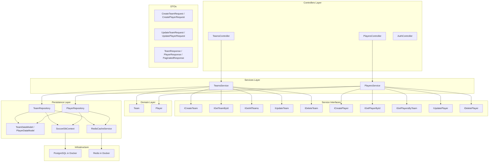

# Soccer Teams & Players CRUD API

## Architecture



## Project Structure (folders in the single `cursor_dotnet_test` project)

```
/Controllers/
  AuthController.cs          -- Register + Login endpoints (JWT)
  TeamsController.cs         -- CRUD for teams, [Authorize]
  PlayersController.cs       -- CRUD for players, [Authorize], [EnableRateLimiting("players")]
/Services/
  Interfaces/
    ICreateTeam.cs, IGetTeamById.cs, IGetAllTeams.cs, IUpdateTeam.cs, IDeleteTeam.cs
    ICreatePlayer.cs, IGetPlayerById.cs, IGetPlayersByTeam.cs, IUpdatePlayer.cs, IDeletePlayer.cs
  TeamsService.cs            -- implements all IXxxTeam interfaces
  PlayersService.cs          -- implements all IXxxPlayer interfaces
/Domain/
  Team.cs                    -- simple POCO (TeamId, TeamName, ManagerName)
  Player.cs                  -- simple POCO (PlayerId, PlayerName, PlayerPosition, PlayerAge, TeamId)
/Persistence/
  DataModels/
    TeamDataModel.cs         -- EF entity with [ConcurrencyCheck] Version
    PlayerDataModel.cs       -- EF entity with [ConcurrencyCheck] Version
  Repositories/
    ITeamRepository.cs
    TeamRepository.cs        -- DB access + Redis caching
    IPlayerRepository.cs
    PlayerRepository.cs      -- DB access + Redis caching
  IRedisCacheService.cs      -- cache abstraction interface
  RedisCacheService.cs       -- Redis implementation with Polly circuit breaker
  SoccerDbContext.cs         -- inherits IdentityDbContext, configures models
/DTOs/
  CreateTeamRequest.cs, UpdateTeamRequest.cs, TeamResponse.cs
  CreatePlayerRequest.cs, UpdatePlayerRequest.cs, PlayerResponse.cs
  PaginatedResponse.cs       -- generic paginated response wrapper
  RegisterRequest.cs, LoginRequest.cs, AuthResponse.cs
/Middleware/
  GlobalExceptionHandler.cs  -- IExceptionHandler implementation
docker-compose.yml
nuget.config
```

## Key Implementation Details

### 1. Docker Compose

- PostgreSQL 16 image, port `5555:5432`, DB `soccer-db`, user/password `postgres`.
- Redis 7 image, port `6379:6379`.

### 2. NuGet Packages

- `Npgsql.EntityFrameworkCore.PostgreSQL` -- EF Core PostgreSQL provider
- `Microsoft.AspNetCore.Identity.EntityFrameworkCore` -- Identity with EF Core
- `Microsoft.AspNetCore.Authentication.JwtBearer` -- JWT auth
- `Microsoft.EntityFrameworkCore.Design` -- migrations tooling
- `StackExchange.Redis` -- Redis client
- `Polly` (v8) -- resilience / circuit breaker for Redis
- `Microsoft.Extensions.Http.Polly` -- Polly integration with Microsoft DI
- Rate limiting is built into ASP.NET Core (no extra package)

### 3. Database & EF Core

- `SoccerDbContext` inherits `IdentityDbContext<IdentityUser>` (stores Identity tables + app tables in same DB).
- Connection string in `appsettings.Development.json`: `Host=localhost;Port=5555;Database=soccer-db;Username=postgres;Password=postgres`.
- `TeamDataModel`: `TeamId` (Guid, PK), `TeamName`, `ManagerName` (unique index), `Version` (int, `[ConcurrencyCheck]`).
- `PlayerDataModel`: `PlayerId` (Guid, PK), `PlayerName`, `PlayerPosition`, `PlayerAge`, `TeamId` (Guid, **no FK**), `Version` (int, `[ConcurrencyCheck]`).
- Player CHECK constraints: `TeamId` must not be empty GUID, `PlayerAge > 0`, `PlayerPosition` must not be empty.
- Program.cs: auto-apply migrations in Development (`context.Database.Migrate()`).
- On shutdown in Development: `db.Database.EnsureDeleted()` so the next run starts fresh.

### 4. No FK Between Team and Player

- `TeamId` on `PlayerDataModel` is a plain `Guid` column -- no navigation property, no `.HasForeignKey()` configuration. This allows future service splitting.

### 5. Concurrency Control

- Each data model has `[ConcurrencyCheck] public int Version { get; set; }`.
- Version is not part of any request DTO -- it is managed internally.
- Repositories atomically increment `Version` via `ExecuteUpdateAsync`. EF Core checks the original value in the `WHERE` clause at save time.

### 6. Efficient Updates & Deletes

- Repositories use `ExecuteUpdateAsync` and `ExecuteDeleteAsync` instead of load-then-save, executing a single SQL roundtrip per operation.
- Affected row count is checked: 0 rows = entity not found (throws `KeyNotFoundException`).

### 7. Domain Layer

- Simple POCOs (`Team`, `Player`) with no logic (stateless app). Services map between domain and data models/DTOs.

### 8. Service Interfaces (one per use case)

- Example: `ICreateTeam` has a single method `Task<Team> CreateTeam(string teamName, string managerName)`.
- `TeamsService : ICreateTeam, IGetTeamById, IGetAllTeams, IUpdateTeam, IDeleteTeam` -- single class implementing all, injected into the controller.
- Same pattern for `PlayersService` with `IGetPlayersByTeam`.

### 9. Controllers & Validation

- All CRUD endpoints decorated with `[Authorize]` (class-level). `AuthController` is unauthenticated.
- Input validation using Data Annotations on request DTOs (`[Required]`, `[StringLength]`, `[Range]`) via `[ApiController]` auto-validation.
- Routes: `[Route("teams")]` and `[Route("players")]`.
- Endpoints:
  - `GET /teams` -> 200 + paginated response (query params: `page`, `pageSize`, `sortBy`, `sortDirection`)
  - `GET /teams/{id}` -> 200 + response DTO body
  - `POST /teams` -> 201 + response DTO (via `CreatedAtAction`)
  - `PUT /teams/{id}` -> 204 no body
  - `DELETE /teams/{id}` -> 204 no body
  - `GET /players?teamId={teamId}` -> 200 + list of players for that team
  - `GET /players/{id}` -> 200 + response DTO body
  - `POST /players` -> 201 + response DTO (via `CreatedAtAction`)
  - `PUT /players/{id}` -> 204 no body
  - `DELETE /players/{id}` -> 204 no body

### 10. Rate Limiting (Players Controller only)

- Built-in `Microsoft.AspNetCore.RateLimiting` middleware.
- Fixed-window policy `"players"`: 10 requests per 10-second window, queue limit of 2.
- Applied via `[EnableRateLimiting("players")]` at class level on `PlayersController`.
- Exceeding the limit returns **429 Too Many Requests**.

### 11. Global Exception Handler

- Implements `IExceptionHandler` (available since .NET 8).
- Handles:
  - `ArgumentException` -> 400 Bad Request
  - `KeyNotFoundException` -> 404 Not Found
  - `DbUpdateConcurrencyException` -> 409 Conflict
  - Unique constraint violations (`PostgresException` with `UniqueViolation`) -> 409 Conflict
  - Transient `NpgsqlException` -> 503 Service Unavailable
  - Unhandled -> 500 Internal Server Error

### 12. ASP.NET Core Identity + JWT

- `AuthController` (no `[Authorize]`) with:
  - `POST /auth/register` -- creates `IdentityUser` via `UserManager`
  - `POST /auth/login` -- validates credentials, returns JWT
- JWT signing key stored in `appsettings.json`.
- Configure `Authentication` with JWT Bearer scheme in `Program.cs`.

### 13. Redis Cache

- All GET operations are cached with a 60-second TTL.
- Cache keys:
  - Individual: `team:{id}`, `player:{id}`
  - Lists: `teams:all:{page}:{size}:{sort}:{asc}`, `players:team:{teamId}`
- On **Create**: invalidate list caches for the affected entity type.
- On **Update**: invalidate the individual key + all list caches for the entity type.
- On **Delete**: invalidate the individual key + all list caches for the entity type.
- If Redis is down, all operations fall through to database lookups without crashing.
- `IConnectionMultiplexer` registered with `abortConnect=false` so startup never fails due to Redis.

### 14. Polly Circuit Breaker for Redis

- `RedisCacheService` wraps every Redis call through a Polly v8 `ResiliencePipeline` with a circuit breaker.
- Circuit breaker configuration:
  - **Failure ratio**: 50% over a 10-second sampling window.
  - **Minimum throughput**: 3 calls before the ratio is evaluated.
  - **Break duration**: 30 seconds in the open state (all Redis calls are skipped instantly).
  - **Handled exceptions**: `RedisConnectionException`, `RedisTimeoutException`, `RedisException`.
- When the circuit is **open**, `BrokenCircuitException` is caught and the operation silently falls back (returns default for GETs, no-op for writes).
- State transitions (opened/half-open/closed) are logged at appropriate levels.

### 15. CORS

- Default policy allowing all origins, methods, and headers.

### 16. Logging

- `ILogger<T>` injected in all services, repositories, the cache service, and the exception handler.
- Structured logging with log-level-appropriate messages (Debug for cache hits/misses, Information for entity operations, Warning for Redis failures).

### 17. Program.cs Wiring

- Services registered: DbContext, Identity, JWT auth, rate limiter, Redis (`IConnectionMultiplexer`), `IRedisCacheService`, repositories, service interfaces (forwarded to single service instances), CORS, exception handler.
- Middleware pipeline: `UseExceptionHandler()`, `UseCors()`, `UseRateLimiter()`, `UseAuthentication()`, `UseAuthorization()`, `MapControllers()`.

### 18. EF Core Migrations

- `InitialCreate` -- base schema with Teams, Players, and Identity tables.
- `AddPlayerCheckConstraints` -- CHECK constraints ensuring TeamId is not empty GUID, PlayerAge > 0, and PlayerPosition is not empty.

### 19. .http File

- Complete test file covering: register, login (capture token), then all Team and Player CRUD operations (including paginated list and players-by-team) with `Authorization: Bearer {{token}}` header.
